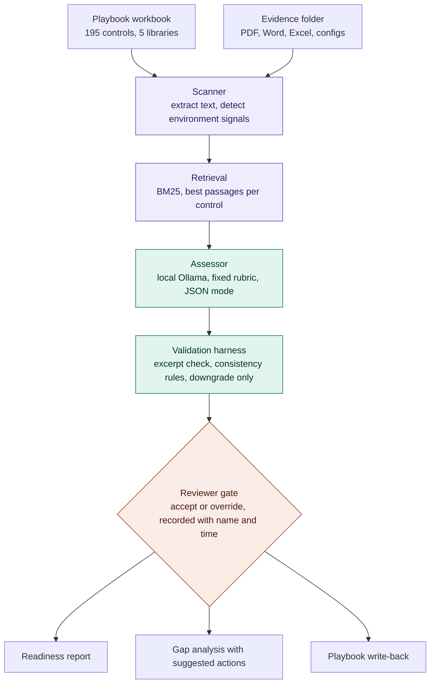

# Architecture

## Pipeline nodes (`pipeline.py`)

`index_folder → match_controls → propose → record_decision → export_playbook`

There is no call path from `propose()` to `write_back()`. The only function that reaches the playbook is `export_playbook()`, and it writes only what `record_decision()` produced. `graphify path "propose()" "write_back()"` returns no path; `graphify path "record_decision()" "write_back()"` does not either, because a human sits between them in the UI — the graph shows the gate as an absence of edges.

## Stages

| Stage | Module | What it does | Can it change a rating? |
|---|---|---|---|
| Scanner | `scanner.py` | Walks the folder, extracts text (pypdf, python-docx, openpyxl, plain read), splits into ~1,800-character passages, matches filenames against environment-signal rules | No |
| Retrieval | `scanner.py` `Index` | BM25 over passages; query is the control's title, requirement and crosswalk text; returns top 3 above a threshold | No — controls with no match are reported as "no evidence located" |
| Assessor | `assessor.py` | One call to the local model with a fixed system prompt; output ordered excerpt → gaps → rationale → rating → maturity → remediation | Proposes only |
| Validation harness | `assessor.py` `_validate` | Excerpt must appear verbatim in evidence; gaps present ⇒ not full; none ⇒ maturity 1; partial ⇒ maturity ≤ 3 | Downgrade only, every rule logged as a flag |
| Reviewer gate | `app.py` Assess tab | Named reviewer accepts or overrides; the AI proposal is stored beside the decision | Yes — the only step that records |
| Outputs | `app.py` Report tab, `playbook.py` | Markdown report, gap analysis table, dated copy of the workbook with Status / Maturity / Evidence / Last reviewed / Gap-notes filled | — |

## Design principle

The tool rates *evidence sufficiency*, never compliance. Three separations keep that honest:

1. **Deterministic before probabilistic** — scanning and retrieval are rule-based and reproducible; the model only sees what retrieval hands it.
2. **Probabilistic under a harness** — every model output passes through rules that can only make it more conservative.
3. **Human before record** — nothing is written to the playbook or the report's "accepted" section until a named person acts.

## Data flow and privacy

All processing is local. Documents are read from disk, passages are held in memory for the session, evidence text sent to the model goes to `localhost:11434` (Ollama). Uploaded PDFs are saved under `data/evidence/`. Assessments persist in `data/assessments.json`. Nothing in `data/` is committed to git.

Switching `ASSESSOR_PROVIDER=anthropic` sends evidence text (and PDFs) to the Anthropic API — use only where the organisation's data-handling rules allow it.
