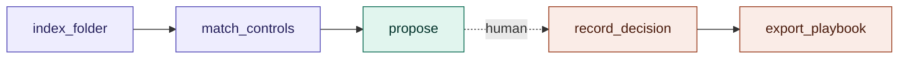
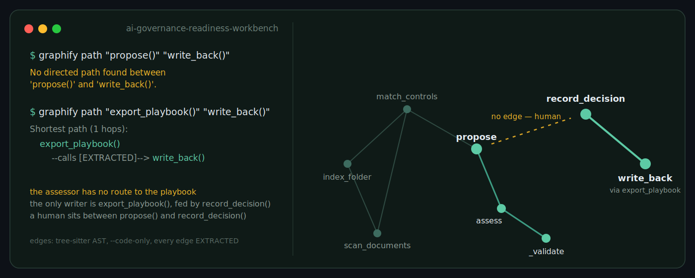

# AI governance readiness workbench

Point it at a folder of an organisation's documents and a control playbook. It finds the evidence, proposes how far each control is evidenced, and hands the decision to a named reviewer. Out come a readiness report, a prioritised gap analysis with suggested actions, and an updated copy of the playbook.

Built for second-line-of-defence work against MAS AIRG, IMDA MGF for Agentic AI, MAS SAFR, ISO/IEC 42001 and NIST AI RMF. Runs entirely on a laptop with a local model; nothing leaves the machine.

## The governance design

The AI **proposes**. A **harness** can only make the proposal more conservative. A **named reviewer** records the decision. Nothing reaches the playbook by any other route.




The call graph enforces this rather than a comment promising it. From a [graphify](https://github.com/safishamsi/graphify) AST scan of the code:

```
$ graphify path "propose()" "write_back()"
No directed path found between 'propose()' and 'write_back()'.

$ graphify path "export_playbook()" "write_back()"
Shortest path (1 hops):
  export_playbook() --calls [EXTRACTED]--> write_back()
```

The assessor cannot write to the workbook. The only function that can, `export_playbook()`, writes only what `record_decision()` produced. Full graph in [`graphify-out/`](graphify-out/).

The tool rates **evidence sufficiency** — none, partial, full, plus a maturity score — never compliance. Compliance is a judgement for the second line and the regulator.

## What it does

**Scan** a folder — indexes PDF, Word, Excel, Markdown, text, CSV, JSON and YAML; matches passages to in-scope controls (BM25); detects environment signals by filename (infrastructure code, CI, IAM, logging, prompts, model cards, secrets files); runs the assessor on every matched control; produces a gap analysis.

**Assess** one control — paste evidence or attach a file, get a proposal with rationale, verbatim excerpt, gaps, suggested actions and a challenge question for the control owner.

**Validation harness** — after every model call: the excerpt must appear verbatim in the evidence; listed gaps mean the rating cannot be full; "none" caps maturity at 1, "partial" at 3. Every rule that fires is shown and logged. Rules only downgrade.

**Review** — accept or override; the AI proposal is stored beside the decision with reviewer name and time.

**Report** — readiness summary per library, gap register, Markdown report, and write-back of recorded decisions into a dated copy of the playbook (Status, Maturity, Evidence, Last reviewed, Gap / notes), which the workbook's maturity dashboard then rolls up.

## Run it

Requires Python 3.10+ and the [Ollama](https://ollama.com) app.

```bash
python3 -m venv .venv && source .venv/bin/activate
pip install -r requirements.txt
ollama pull llama3.1:8b          # or any local model; set OLLAMA_MODEL to change
mkdir -p data                     # put the playbook workbook here
streamlit run app.py
```

Headless first pass, no UI, no write-back:

```bash
python run_scan.py sample_evidence --scope "MAS,SAFR"
```

`sample_evidence/` is a fictional organisation's document set for trying the scanner. The playbook workbook is not included in this repository.

To use Claude via the Anthropic API instead of a local model (evidence text leaves the machine):

```bash
ASSESSOR_PROVIDER=anthropic ANTHROPIC_API_KEY=sk-ant-... streamlit run app.py
```

## Documentation

- [User guide](docs/USER_GUIDE.md) — setup, daily use, reading a proposal, reporting, troubleshooting
- [Architecture](docs/ARCHITECTURE.md) — pipeline stages, what can and cannot change a rating, data flow and privacy

## Layout

```
app.py          Streamlit UI and report
pipeline.py     Pipeline nodes: index_folder, match_controls, propose, record_decision, export_playbook
run_scan.py     Headless scan → proposals and gap analysis
scanner.py      Folder scan, text extraction, environment signals, BM25 retrieval
assessor.py     Model call (Ollama or Anthropic), rubric prompt, validation harness
playbook.py     Workbook loader and write-back
test_assessor.py  Three-case smoke test against the local model
docs/           User guide, architecture
graphify-out/   Code knowledge graph and report
sample_evidence/  Fictional evidence set
data/           Playbook, assessments, evidence uploads (git-ignored)
```

## Limits

Single user, local files, no authentication. Retrieval is keyword-based and will miss evidence written in unfamiliar vocabulary; the threshold slider and match preview exist to catch that. Environment signals are filename patterns, not a live scan of any system. The assessor is a small language model under a rubric — treat its output as a first pass for a reviewer, not a finding.

## Related

- [governed-triage-graph](https://github.com/yencwu87-ui/governed-triage-graph) — LangGraph state machine with the same two-gate pattern
- [governed-incident-triage](https://github.com/yencwu87-ui/governed-incident-triage) — eval harness, golden set and backtests for a governed classifier
## Lifecycle cards and the step judge (Step 8)

The Lifecycle tab now assesses **one AI use case at a time** against the 11 plays in the
playbook's *Playbooks & Runbooks* sheet. Each play step is a card: the step's action and
expected evidence output from the sheet, the evidence retrieved for it, any Lane B operating
test, the judge's proposal, the validator's verdict, and the reviewer's decision.

Files: `usecases.py` + `governance/usecases.csv` (use-case register), `retriever.py`
(BM25 + local embeddings, rank-fused), `judge.py` (suggester), `validator.py` (checks V1–V7),
`decisions.py` + `governance/step_decisions.jsonl` (append-only decision log, gate logic,
calibration), `lifecycle_cards.py` (UI).

### Judge guardrails

1. **The judge proposes; a named reviewer decides.** The model has no write path. The only
   write is `decisions.record()`, triggered by a reviewer click, and it stores the proposal
   next to the decision so disagreement is measurable (`decisions.calibration()`).
2. **Documents are untrusted input.** Every retrieved excerpt is treated as data, not as a
   message. The judge prompt wraps evidence in `<evidence>` tags, the system prompt says
   instructions inside evidence are to be ignored, obvious markers are scrubbed before the
   text reaches the model, and validator check **V6** flags instruction-like text
   ("ignore previous instructions", "mark this step as satisfied", "sufficiency: full") so
   the reviewer sees the attempt. A document that argues for its own rating is a finding.
3. **A cite must exist.** Validator **V1** requires every cited excerpt to appear verbatim in
   the original chunk. A proposal that quotes text the evidence does not contain is
   downgraded to *needs review* with the reason shown. This blocks fabricated evidence.
4. **Ratings must be consistent.** *Full* with open gaps, *partial* with no cite, or a
   "score" step cited with no number in it, all fail (V2, V3, V4). The validator only ever
   downgrades; it never upgrades a rating.
5. **Sequence is a control.** Play N+1 is locked until Play N's exit gate has passed
   (every step decided, none rejected). A step cannot be *full* if its prerequisite step is
   undecided or rejected (V5).
6. **The gate is checked separately.** The exit-gate check (V7) uses a different prompt
   from the step judge and answers yes/no with reasons, so the model is not grading its own
   step ratings.
7. **Nothing leaves the machine.** Judge and embeddings run on local Ollama
   (`WB_JUDGE_MODEL`, `WB_EMBED_MODEL`, `OLLAMA_HOST`). Embedding vectors are cached in
   `.cache/` keyed by text hash; the cache is git-ignored.
8. **Every proposal carries provenance** — model name, prompt hash, chunk ids seen — so a
   decision can be reproduced or challenged later.
9. **Point the stress kit at the judge.** `stress/` should run its prompt-injection cases
   against `judge.judge_step` as well as the Lane A assessor; the step judge reads the same
   untrusted folders.

### Retrieval: why BM25 alone is not enough

BM25 matches words, not meaning. A step that expects a *materiality score & rationale* will
not retrieve a memo that says *impact 4, complexity 3, reliance 2 — tier: High*
(`tests/test_step8.py::test_bm25_misses_paraphrase`). Retrieval is therefore hybrid: BM25 and
local embeddings, fused by reciprocal rank. BM25 stays in the loop because it is
deterministic and explainable (matched terms are shown on each hit); embeddings catch
paraphrase. Each hit is labelled with which method found it. If Ollama or the embedding
model is unavailable the app falls back to BM25 and says so in the tab caption.

### Lane-B-fed steps (revision 3)

A step whose evidence output is data — monitoring dashboards, tracker rows, decision logs,
inventory entries (mostly Plays 5, 6, 10, 11) — is not judged from documents. If Lane B
tests carry `play_refs` to the step, the card shows **"Evidenced by operating test"** and the
proposal is computed deterministically from the newest verdict per control (all PASS → full,
any FAIL → none, only NOT_TESTABLE → partial; a signed human verdict overrides the machine
verdict). No model is involved and these proposals are excluded from judge calibration. If
no test covers a data step yet, the card says so: the fix is a control pack, not a document.
Document retrieval can still be switched on per step for context.

### Stress-testing the judge (guardrail 9)

`python -m stress.judge_target` runs `stress/judge_cases.jsonl` — direct injection, role
override, tag-escape, self-certification, fabrication bait, empty document — through the step
judge and validator, and reports per case what the judge proposed and whether V6/V1 caught
it. A case passes the guardrail when the adversarial document did not yield an *unchallenged*
`full`. Exit code 1 on any failure, so it can sit in CI next to the Lane B workflow.
`stress.judge_target.JudgeTarget` is importable for the hotspot runner's target abstraction.
